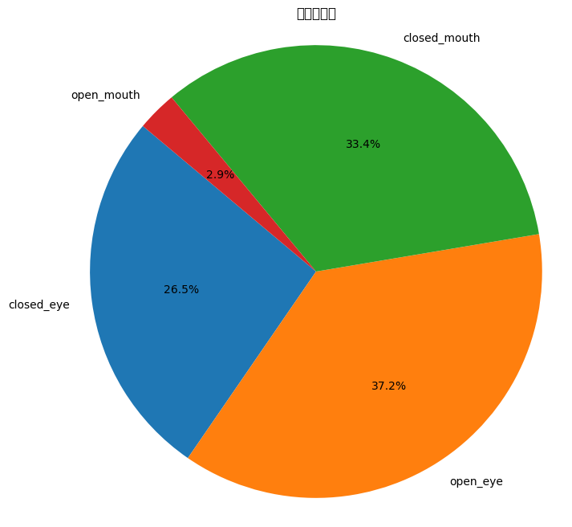

### 趋动云GPU训练模型
我在趋动云社区发布了一个高质量开源项目，一起来体验下吧
疲劳驾驶模型训练v3.2：https://open.virtaicloud.com/web/project/detail/470845171165196288 点击右上角运行一下
可优化参数对比效果
### 增加数据集比例饼图

### 优化参数方案二：增加参数 
趋动云最低配置，训练时间18分钟
使用参数epochs=30, imgsz=640, batch=16,workers=2,mosaic=0.7, mixup=0.3,copy_paste=0.2

### 新增项目开发流程说明文档