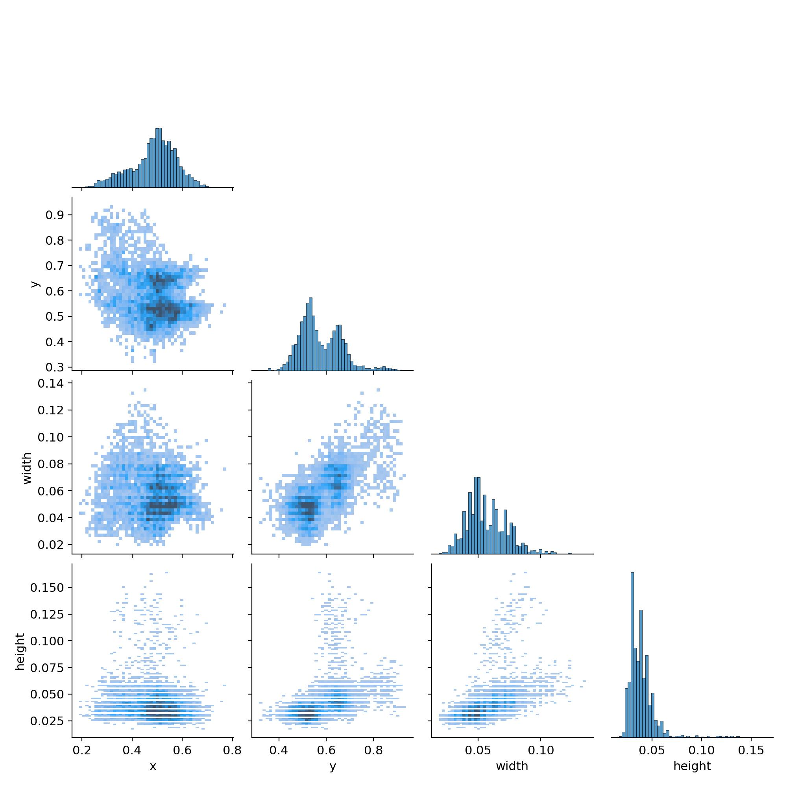

# 项目开发流程

## 1.数据集

- 1.1.数据集选择：使用百度PP飞浆上的数据集，数据集地址：<https://aistudio.baidu.com/datasetdetail/105521>
- 1.2.数据集包含：Fatigue.zip,压缩包包含：Annotations和JPEGImages，分别是标注文件和图片文件
- 1.3.数据集说明：图片2915张，标注文件2914个，图片尺寸为640*4840，标签格式为xml，包含类别、坐标、宽高等信息
- 1.4.数据平衡：数据集类别'closed_eye', 'open_eye'这一对比较平衡，'closed_mouth','open_mouth'不平衡。

- 1.5.数据集预处理：数据集预处理代码在train3.ipynb中,大致流程:
  - 压缩包读取并解压
  - 1.5.2. 数据集中'JPEGImages'文件名换成'images'以适配YOLOv8的要求
  - 1.5.3. 删除没有标签的图片，最终仅删除一张图片
  - 1.5.4. 转换VOC格式数据为YOLO格式
  - 1.5.5. 绘制数据集饼图，'closed_mouth','open_mouth'这一对不平衡

  - 1.5.6. 8:2分割训练集和测试集
  - 1.5.7. 将数据集路径写入文本文件train_images.txt、val_images.txt、train_labels.txt、val_labels.txt
  - 1.5.8. 生成my_det_data.yaml文件
  - 1.5.9. 数据增强：使用数据增强，使用参数mosaic=0.7, mixup=0.3,copy_paste=0.2
    与使用YOLOV8默认的数据增强参数对比图
    

## 2、模型

- 2.1. 模型选择：使用YOLOv8模型
- 2.2. 选择原因：YOLOv8模型具有丰富的功能，便于未来扩展安全驾驶相关的其他任务，比如是否一边开车一边玩手机、是否酒驾、是否系安全带等危险驾驶行为。并且YOLOv8具有高精度和实时检测的特点。它能够在较短时间内处理大量图像数据，非常适合需要快速响应的疲劳驾驶检测。
- 2.3. yolov8模型参数配置

  - 'train': 'paths/train_images.txt',
  - 'val': 'paths/val_images.txt',
  - 'nc': 4,  
  - 'names': ['closed_eye', 'open_eye','closed_mouth','open_mouth']
- 2.4. 加载yolov8模型model = YOLO("yolov8n.yaml")

## 3、训练参数设置

- epochs=30
- imgsz=640
- batch=16
- workers=2
- mosaic=0.7
- mixup=0.3
- copy_paste=0.2

## 4、模型训练

- 4.1. 使用趋动云最低配置算力规格：B1.small
- 4.2. 将train3.ipynb挂在趋动云上，进入开发环境调试运行
- 4.3. 用时18分钟

## 5、训练结果

## 6、项目开源体验

我在趋动云社区发现了一个开源项目，一起来体验下吧
疲劳驾驶模型训练v3.2：<https://open.virtaicloud.com/web/project/detail/471879287792889856>

## 7、模型推理

### 7.1. 图片演示

### 7.2. 摄像头演示

运行fatigue_driving\inference.py
